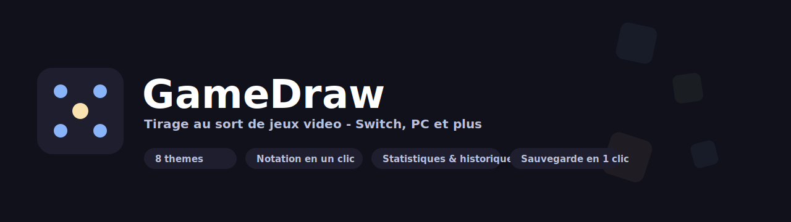
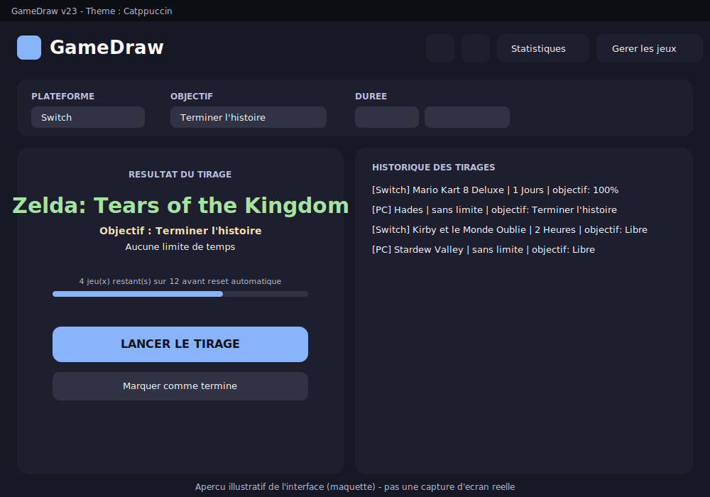

<p align="center">
  
</p>

<p align="center">
  
  
  
  
</p>

---

## Apercu

<p align="center">
  
</p>

> Ceci est une **maquette illustrative**, pas une vraie capture d'ecran (generee sans acces a un
> environnement Windows). Pour la remplacer par une vraie capture : lance l'app, `Win+Maj+S` ou
> l'Outil Capture, enregistre en `.png` dans `assets/gamedraw-screenshot.png`, puis remplace la
> ligne `` ci-dessus par `assets/gamedraw-screenshot.png`.

## En bref

**Le syndrome du "j'ai 200 jeux et je relance Minecraft pour la 47e fois" a enfin un remede.**

GameDraw resout la paralysie du choix face a une ludotheque trop fournie : un clic, un jeu tire
au sort dans ta bibliotheque (Switch, PC, ou toute autre plateforme que tu ajoutes), avec un
roulement equitable (chaque jeu passe une fois avant qu'un autre repasse - meme lui, oui, meme
celui que tu as achete en solde et jamais lance), une duree de session optionnelle pour eviter le
"encore une partie" qui dure 4h, et un historique complet pour prouver a qui de droit que tu joues
vraiment a autre chose que Mario Kart.

## Fonctionnalites

- **Tirage equitable** avec pool anti-repetition et reset automatique, animation "roulette" au tirage
- **Bibliotheques multi-plateformes** illimitees (Switch, PC, ou autre), avec recherche/filtre
- **Notation en un clic** directement sur les icones affichees (etoile, coeur, pouce, trophee ou diamant au choix), couleur personnalisable pour la note maximale
- **Catalogues de jeux predefinis et editables** (Switch 1, Switch 2, PC) pour peupler une bibliotheque en un clic
- **8 themes visuels** : Catppuccin, Ocarina of Time, Cyberpunk, Foret, Dracula, Pip-Boy, Super Mario, Dragon
- **Statistiques** par plateforme (taux de notation, temps de session cumule, nombre de tirages)
- **Sauvegarde / restauration** en un clic (.zip contenant toutes les donnees) via boites de dialogue Windows natives
- **Interface adaptive** : fenetre redimensionnable, bascule automatique en disposition verticale sous ~850px de large
- **Personnalisation etendue** (densite d'affichage, animation, valeurs par defaut) centralisee dans un menu Options
- Journalisation des erreurs (`%USERPROFILE%\GameDraw\error.log`) pour un diagnostic rapide

Documentation complete (architecture, schemas JSON, diagrammes) : [`docs/GameDraw-Documentation.md`](docs/GameDraw-Documentation.md) - compatible import direct dans WikiJS.

## Installation

1. Extraire ce dossier dans un emplacement **stable et definitif** (ex: `C:\GameDraw`) - a eviter :
   `Downloads` ou tout dossier qui contient un numero de version dans son nom, pour que les futures
   mises a jour et le raccourci Bureau restent valides sans y retoucher.
2. Lancer `Launcher.bat`, ou mieux : cree le raccourci Bureau depuis l'app (Options -> Creer un
   raccourci sur le Bureau) qui elance PowerShell directement, sans fenetre intermediaire.
3. Dans l'application : **Options -> Creer un raccourci sur le Bureau** (ou executer
   `scripts\Creer-Raccourci.ps1`).

Aucune installation de PowerShell/WPF requise : natifs sous Windows 11.

## Mettre a jour

Les donnees (bibliotheques, historique, config) vivent dans `%USERPROFILE%\GameDraw`, **jamais**
dans le dossier d'installation. Une mise a jour ne touche donc jamais tes donnees.

```powershell
.\scripts\Update-GameDraw.ps1 -Source "C:\Users\toi\Downloads\GameDraw_Package_vXX.zip"
```

Ce script sauvegarde l'installation actuelle avant d'ecraser le code (`scripts\`, `assets\`,
`docs\`, `Launcher.bat`) avec la nouvelle version. Voir la doc complete pour le detail.

## Donnees

| Fichier | Contenu |
|---|---|
| `%USERPROFILE%\GameDraw\config.json` | Theme, icone de notation, densite, preferences |
| `%USERPROFILE%\GameDraw\platforms.json` | Liste des plateformes |
| `%USERPROFILE%\GameDraw\<plateforme>_games.json` | Bibliotheque de jeux par plateforme |
| `%USERPROFILE%\GameDraw\historique.json` | Historique des tirages |
| `%USERPROFILE%\GameDraw\catalogues.json` | Catalogues de jeux predefinis (editables) |
| `%USERPROFILE%\GameDraw\error.log` | Journal d'erreurs |

## Identite visuelle

| Fichier | Usage |
|---|---|
| `assets/GameDraw_v2.ico` | Icone de l'application (barre des taches, raccourci) |
| `assets/gamedraw-cover.svg` | Banniere large (en-tete de ce README) |
| `assets/gamedraw-logo.svg` | Logo horizontal (wordmark + badge) |
| `assets/gamedraw-icon.svg` | Icone carree (avatar de depot Git / preview sociale) |
| `assets/gamedraw-mockup.svg` | Maquette illustrative de l'interface (a remplacer par une vraie capture, voir ci-dessus) |

Toutes les couleurs suivent la palette du theme Catppuccin (theme par defaut). Pour matcher un
autre theme, voir la table des couleurs dans `docs/GameDraw-Documentation.md`.

## Licence

[MIT](LICENSE) - fais-en ce que tu veux, sans garantie. C'est le choix le plus simple et le plus
permissif pour un projet perso ; change pour une autre licence (GPL si tu veux forcer le partage
des modifications, Unlicense pour du domaine public pur) si tes besoins evoluent.
