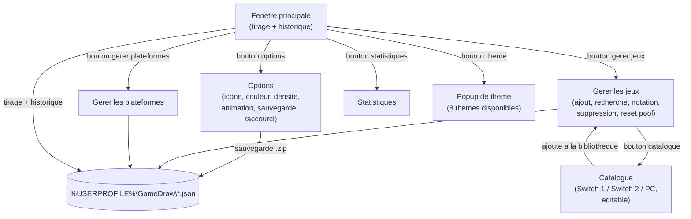

# GameDraw - Documentation

> Application de tirage au sort de jeux video (Switch / PC / autre) avec suivi de session,
> notation, catalogues, statistiques et themes visuels.
> Page compatible import direct dans **WikiJS** (format Markdown + Mermaid).


## Vue d'ensemble

GameDraw est un outil PowerShell + WPF permettant de tirer au sort un jeu dans une bibliotheque
(Switch, PC, ou toute plateforme ajoutee par l'utilisateur), avec une duree de session
parametrable, une notation par icones cliquables, des catalogues de jeux predefinis et editables,
des statistiques par plateforme, et 8 themes visuels. L'objectif reste d'eviter la "paralysie du
choix" face a une ludotheque trop fournie, tout en garantissant un roulement equitable entre les
jeux.

## Architecture des fichiers

| Composant | Role |
|---|---|
| `Launcher.bat` | Point d'entree manuel (double-clic direct). Le raccourci Bureau (voir plus bas) cible PowerShell directement et evite toute fenetre intermediaire. |
| `scripts/Tirage-Jeux.ps1` | Script principal (interface WPF, logique de tirage, gestion JSON). |
| `scripts/Creer-Raccourci.ps1` | Cree un raccourci Bureau sans fenetre de console (egalement possible depuis Options in-app). |
| `scripts/Update-GameDraw.ps1` | Met a jour l'installation depuis un nouveau .zip/dossier sans toucher aux donnees. |
| `assets/GameDraw_v2.ico`, `GameDraw_icon_bleu.ico`, `GameDraw_icon_sombre.ico` | Icones d'application disponibles (choix dans Options). |
| `assets/GameDraw_logo.png` | Logo affiche dans l'en-tete de l'application. |
| `assets/gamedraw-logo.svg` | Logo vectoriel pour le depot Git / README (couleurs du theme par defaut). |
| `%USERPROFILE%\GameDraw\*.json` | Donnees persistantes (voir plus bas). Jamais dans le dossier d'installation. |
| `%USERPROFILE%\GameDraw\error.log` | Journal d'erreurs, alimente automatiquement. |

## Arborescence du package

```
GameDraw_Package/
+-- README.md
+-- Launcher.bat
+-- assets/
|   +-- GameDraw_v2.ico
|   +-- GameDraw_logo.png
|   +-- gamedraw-logo.svg
+-- scripts/
|   +-- Tirage-Jeux.ps1
|   +-- Creer-Raccourci.ps1
|   +-- Update-GameDraw.ps1
+-- docs/
    +-- GameDraw-Documentation.md   (ce fichier)
```

## Schema des fenetres



## Installation

1. Extraire le zip dans un dossier **stable et definitif** (ex: `C:\GameDraw`) - eviter `Downloads`
   ou tout dossier nomme avec un numero de version, pour que le raccourci Bureau et les futures
   mises a jour restent valides sans intervention.
2. Lancer `Launcher.bat` une premiere fois (demande d'elevation UAC, normal).
3. Dans l'application : **Options -> Creer un raccourci sur le Bureau**, ou executer
   `scripts\Creer-Raccourci.ps1` (clic droit -> Executer avec PowerShell). Ce raccourci cible
   PowerShell directement (ni `.bat`, ni `.vbs`) et demande l'elevation automatiquement au
   double-clic, sans la moindre fenetre intermediaire.

> Si l'execution de scripts est bloquee par la politique locale : `Set-ExecutionPolicy -Scope
> CurrentUser RemoteSigned` dans une invite PowerShell administrateur.

## Mise a jour

Les donnees utilisateur vivent entierement dans `%USERPROFILE%\GameDraw`, jamais dans le dossier
d'installation. Une mise a jour du code n'affecte donc jamais les donnees.

```powershell
cd C:\GameDraw
.\scripts\Update-GameDraw.ps1 -Source "C:\Users\toi\Downloads\GameDraw_Package_vXX.zip"
```

Le script :
1. Detecte automatiquement si `-Source` est un `.zip` ou un dossier deja extrait.
2. Sauvegarde l'installation actuelle dans `%TEMP%\GameDraw_AvantMAJ_<horodatage>` avant toute
   modification (filet de securite en cas de probleme).
3. Remplace uniquement `scripts\`, `assets\`, `docs\` et `Launcher.bat` - jamais les donnees.

**Recommandation** : garder toujours le meme dossier d'installation (`C:\GameDraw` par exemple)
plutot que d'extraire chaque nouvelle version dans un dossier different portant son numero de
version - c'est la source la plus frequente de confusion ("je corrige mais rien ne change" alors
qu'en realite l'ancienne version tourne encore depuis un autre dossier).

## Fonctionnement du raccourci Bureau (sans fenetre console, sans VBS)

Le raccourci cree par `Creer-Raccourci.ps1` (ou depuis Options) cible `powershell.exe`
**directement** (`-WindowStyle Hidden -File Tirage-Jeux.ps1`), sans passer par un fichier `.bat`
ou `.vbs` intermediaire. L'elevation administrateur est geree en patchant directement un octet du
fichier `.lnk` (offset `0x15`, bit `0x20` - c'est le flag standard "Executer en tant
qu'administrateur" que Windows utilise en interne), plutot que de cocher la case manuellement dans
Proprietes > Avance. Resultat : un simple double-clic declenche l'UAC directement, sans aucune
fenetre de console visible a aucun moment.

`Launcher.bat` reste le point d'entree pour un lancement manuel sans raccourci ; il laisse
apparaitre brievement sa propre fenetre le temps de s'auto-elever, ce qui est une limitation
inherente aux fichiers `.bat` (contrairement au raccourci, qui n'a pas cette limitation).

> Consequence directe : toute exception non interceptee serait invisible sans le systeme de
> journalisation. C'est pourquoi chaque action de l'interface est enrobee dans `Invoke-Safe`, qui
> journalise dans `error.log` et affiche une boite de dialogue au lieu d'echouer silencieusement.


## Themes visuels

8 themes disponibles via le bouton palette dans l'en-tete. Chacun definit 10 couleurs
(`ACCENT`, `SUCCESS`, `BG`, `CARD`, `INPUT`, `BORDER`, `DARKBG`, `MUTED`, `DANGER`, `WARNING`)
appliquees a l'ensemble de l'interface par remplacement de gabarits `{{CLE}}` dans le XAML.

| Theme | Identite |
|---|---|
| Catppuccin | Palette pastel violet/bleu, theme par defaut |
| Ocarina of Time | Bois/cuir du menu, or Triforce/rubis, vert Kokiri, bleu Navi |
| Cyberpunk | Rose neon / cyan sur fond tres sombre |
| Foret | Verts profonds |
| Dracula | Palette officielle Dracula (tres appreciee des devs) |
| Pip-Boy | Terminal phosphore vert monochrome (Fallout) |
| Super Mario | Bleu salopette + rouge, vert Luigi, orange Bowser |
| Dragon | Antre obscur, feu orange, ecailles vertes |

Le selecteur de theme est un vrai `Popup` WPF (et non un panneau dans la grille) : il flotte
au-dessus de l'interface sans jamais affecter la mise en page environnante.

## Icones de notation

Choix dans **Options** parmi : Etoile, Coeur, Pouce, Trophee, Diamant. La notation se fait en
cliquant directement sur les icones affichees dans la liste des jeux (survol = previsualisation),
sans bouton dedie. La couleur de l'icone a la note maximale (5/5) est personnalisable (code
hexadecimal).

## Catalogues predefinis

Trois catalogues editables (`Switch1`, `Switch2`, `PC`) accessibles depuis **Gerer les jeux ->
Catalogue**. Chaque entree peut etre retiree (bouton supprimer) et de nouvelles entrees ajoutees
librement ; les catalogues sont persistes dans `catalogues.json` et independants des bibliotheques
de jeux elles-memes.

## Structure des donnees JSON

### `config.json`

```json
{
  "Theme": "Catppuccin",
  "CouleurEtoiles": "#FFD700",
  "IconeNotation": "Etoile",
  "Densite": "Confortable",
  "HistoriqueCount": 15,
  "AnimationTirage": true,
  "EviterRepetitionDefaut": true,
  "ObjectifDefaut": ""
}
```

### `platforms.json`

```json
[
  { "Nom": "Switch", "Actif": true, "Fichier": "switch_games.json" },
  { "Nom": "PC", "Actif": true, "Fichier": "pc_games.json" }
]
```

### `<plateforme>_games.json`

```json
[
  { "Nom": "Zelda: Tears of the Kingdom", "DejaFait": false, "Note": 5, "Refaire": false, "TypeFin": "",
    "Cover": "", "Logo": "", "Screenshot": "", "Icone": "", "Commentaire": "" },
  { "Nom": "Mario Kart 8 Deluxe", "DejaFait": true, "Note": 4, "Refaire": true, "TypeFin": "",
    "Cover": "C:\\Users\\...\\GameDraw\\images\\Switch\\Mario_Kart_8_Deluxe\\Cover.jpg", "Logo": "", "Screenshot": "", "Icone": "", "Commentaire": "Super avec la manette Pro" }
]
```

- `DejaFait` : bascule a `true` apres un tirage, sert au systeme anti-repetition (reset
  automatique quand tout le pool est epuise).
- `Note` : 0 a 5, notee en cliquant directement sur les icones dans "Gerer les jeux".
- `Refaire` : indicateur libre "envie de refaire".
- `Cover` / `Logo` / `Screenshot` / `Icone` : chemins vers des images choisies localement via la
  **Fiche du jeu** (bouton dans "Gerer les jeux"). Les fichiers sont copies dans
  `%USERPROFILE%\GameDraw\images\<plateforme>\<jeu>\` plutot que reference a leur emplacement
  d'origine, pour rester valides meme si le fichier source est deplace, et pour etre inclus dans
  les sauvegardes .zip. La jaquette (`Cover`, ou a defaut `Icone`) s'affiche en vignette dans la
  liste des jeux.
- `Commentaire` : note libre en texte (distincte de la note chiffree 0-5).

### `historique.json`

```json
[
  {
    "Jeu": "Zelda: Tears of the Kingdom",
    "Plateforme": "Switch",
    "DateTirage": "2026-07-05T14:46:10.0000000+02:00",
    "DateFin": "06/07/2026 14:46",
    "Duree": "1 Jours",
    "Objectif": "Terminer l'histoire"
  }
]
```

### `catalogues.json`

```json
{
  "Switch1": ["The Legend of Zelda: Breath of the Wild", "..."],
  "Switch2": ["Mario Kart World", "..."],
  "PC": ["The Witcher 3: Wild Hunt", "..."]
}
```

## Icone de l'application

Trois choix disponibles dans **Options** (avec apercu visuel) : Original, Bleu (carnet), Sombre
(neon). Le changement s'applique a la prochaine ouverture de fenetre (meme mecanisme que le
changement de theme).

## Jaquettes de jeux en ligne

Le bouton **"Chercher une jaquette en ligne"** dans la Fiche du jeu ouvre une recherche
pre-remplie sur [SteamGridDB](https://www.steamgriddb.com/), la reference communautaire pour ce
type d'usage (utilisee notamment par Playnite et LaunchBox). Alternative : [LaunchBox Games
Database](https://gamesdb.launchbox-app.com/). Le fichier telecharge doit ensuite etre importe
manuellement via "Choisir..." dans la Fiche du jeu (pas de telechargement automatique, pour eviter
toute dependance a une cle API).

## Statistiques

Par plateforme : nombre total de jeux, jeux notes (et pourcentage), jeux "deja tires" dans le
cycle courant, nombre de tirages enregistres et temps de session cumule (calcule a partir des
durees renseignees dans l'historique).

## Sauvegarde / restauration

**Options -> Sauvegarder la config** : regroupe tous les `.json` de `%USERPROFILE%\GameDraw` dans
une archive `.zip` choisie via la boite de dialogue Windows native.

**Options -> Restaurer une config** : selection d'une archive, confirmation (operation
destructive), extraction et remplacement des fichiers actuels, puis rechargement de l'application.

## Interface adaptive

- Toutes les fenetres ont une taille minimale (`MinWidth`/`MinHeight`) pour eviter la casse du
  layout en dessous d'un certain seuil.
- La fenetre principale reagit a son redimensionnement : sous ~850px de large, le bloc
  "resultat du tirage" et le bloc "historique" passent d'une disposition cote-a-cote a une
  disposition empilee verticalement, automatiquement.

## Diagnostic

Toute action de l'interface est enrobee dans `Invoke-Safe`, qui :
1. Execute l'action dans un bloc `try/catch`.
2. En cas d'erreur : journalise dans `%USERPROFILE%\GameDraw\error.log` (horodatage, message,
   pile d'appel) et affiche une boite de dialogue explicite au lieu d'un plantage silencieux.

En cas de comportement inattendu, la premiere chose a fournir pour un diagnostic est le contenu de
ce fichier.

## Historique des versions (resume)

| Version | Points cles |
|---|---|
| v11 | Version de base : themes, gestion jeux/plateformes, tirage avec duree |
| v13-v15 | Correction couleur des etoiles (rendu direct sans binding XAML), correction persistance du theme (config.json) |
| v16-v17 | Refonte du selecteur de theme (Popup), theme Ocarina of Time authentique, 4 nouveaux themes, notation par clic direct, recherche, catalogues Switch/PC |
| v18-v19 | Corrections de caracteres Unicode hors plan de base (icones), animation de tirage, statistiques, barre de pool |
| v20 | Generalisation du systeme de config, personnalisation etendue (densite, animation, valeurs par defaut), Invoke-Safe generalise |
| v21 | README + documentation a jour, script de mise a jour, raccourci bureau in-app, interface adaptive |
| v22 | Correction de fonctions imbriquees non resolues depuis des blocs Invoke-Safe (notation par clic, rafraichissement post-tirage, menus Options) |
| v23 | Refonte du mecanisme d'animation de tirage (objet mutable au lieu de variables $script: + closures), correction des listes deroulantes illisibles sur certains themes, tentative de rechargement automatique si une fenetre echoue a s'ouvrir |
| v24 | Harmonisation des icones sur Segoe Fluent Icons (theme, options, statistiques, catalogue, suppression, rafraichir), visuels pour le depot Git (banniere, icone, maquette d'interface) |
| v25 | Fiche du jeu par titre : jaquette, logo, capture d'ecran, icone (images locales copiees dans le dossier de donnees) et commentaire libre ; vignette dans la liste ; sauvegarde/restauration etendue aux images |
| v26 | Choix de l'icone de l'application (3 options, avec apercu dans Options), lanceur sans fenetre console visible, recherche de jaquette en ligne (SteamGridDB) depuis la Fiche du jeu |
| Beta 0.1 | Passage au schema de version "Beta X.Y" (affichee discretement en bas a droite de la fenetre principale au lieu de la barre de titre) ; vignette (jaquette/icone) dans l'historique ; effets visuels au tirage (jaquette du jeu tire affichee en grand, animation "pop", confetti) ; LICENSE (MIT) |
| Beta 0.2 | Retrait complet du VBS (raccourci ciblant PowerShell directement avec flag d'elevation patche dans le .lnk) ; correction du changement d'icone qui ne s'appliquait pas (declenchait desormais un rechargement) ; icones fournies rendues transparentes ; nouveau Backlog (vue en grille avec pochettes et fiches completes) ; ombres portees sur les cartes principales |
| Beta 0.1 | Passage au schema de version "Beta X.Y" (affichee discretement en bas a droite de la fenetre principale au lieu de la barre de titre) ; vignette (jaquette/icone) dans l'historique ; effets visuels au tirage (jaquette du jeu tire affichee en grand, animation "pop", confetti) ; LICENSE (MIT) |
